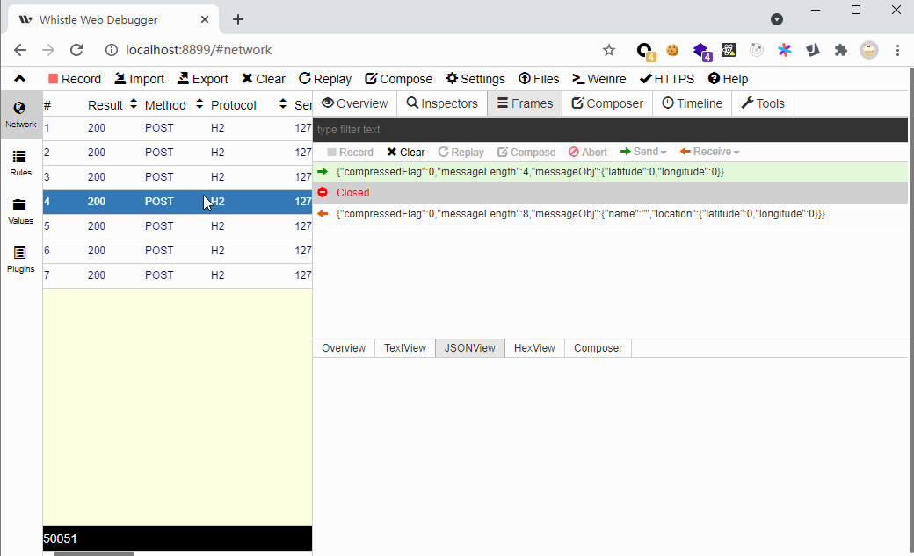

# 以customerParser方式解包http请求的示例（grpc over http2）

grpc请求的底层是http2，http2 stream 实质上是一种长连接，可以用whistle customerParser的方式进行抓包解包

## 运行方式
1. node >= 12, whistle >= 2.7.21
2. npm i
3. npm run dev


## 配置规则

`localhost:50051  custom-http:// enable://customParser`
如果发现不能代理，需要配置一下switchomega，参考  https://github.com/avwo/whistle/issues/266

## hello world示例
这是一个 [UnaryCall](https://grpc.github.io/grpc/node/grpc-ClientUnaryCall.html) 的例子, 
```
node ./examples/greeter_server.js 
node ./examples/greeter_client.js 
```
可以在Frames里面看到一应一答的传输帧


## route_guide 示例
这是一个 [stream](https://grpc.github.io/grpc/node/grpc-ClientDuplexStream.html) 的例子，包括各种方向的stream, 
```
node ./examples/route_guide/route_guide_server.js 
node ./examples/route_guide/route_guide_client.js 
```
可以在Frames里面看到长连接中每一帧的具体解包示例


